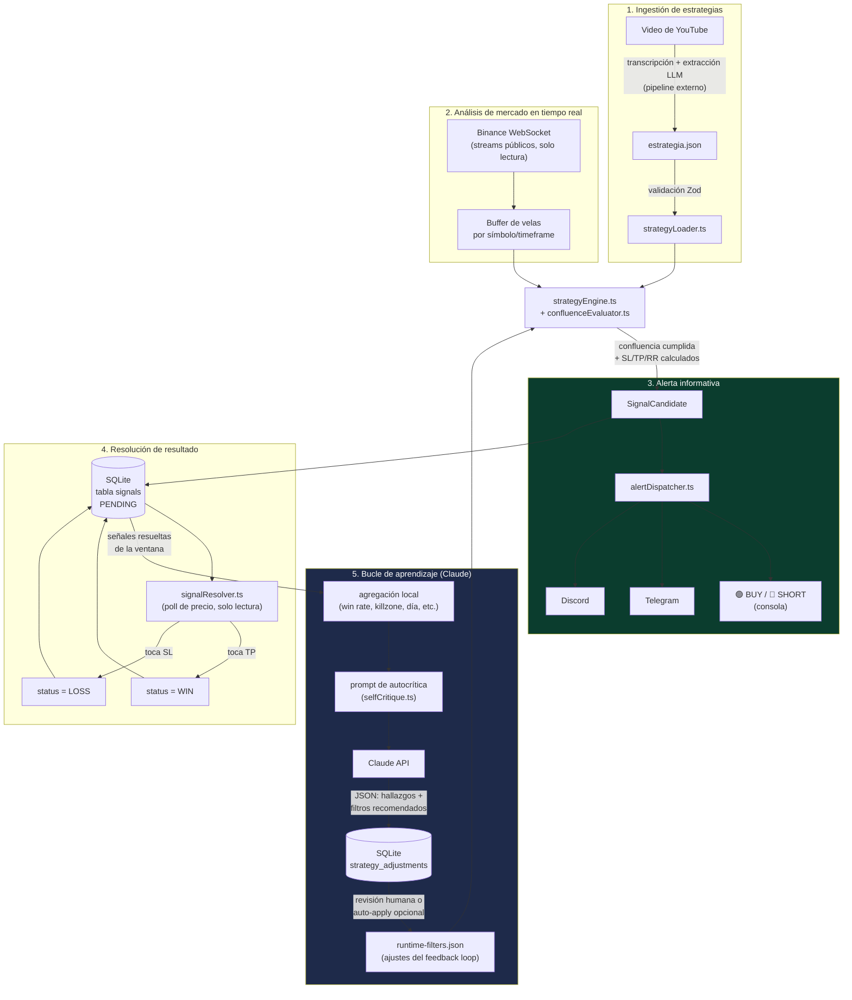

# Arquitectura — Bot de Alertas de Trading con Aprendizaje Autónomo

## 1. Principio rector: Human-in-the-loop

Este sistema **no coloca, modifica ni cancela órdenes**. Es un copiloto de
análisis técnico cuyo único efecto en el mundo exterior es una **alerta
informativa** (consola, Telegram o Discord). Ni el motor de estrategias ni el
bucle de aprendizaje de Claude tienen, en ningún punto del código, acceso a
un endpoint de trading. Ver [`src/security/readOnlyGuard.ts`](../src/security/readOnlyGuard.ts).

## 2. Diagrama de flujo de datos

## 3. Módulos

| Módulo | Responsabilidad | Archivos clave |
|---|---|---|
| Seguridad | Bloquear cualquier capacidad de trading; solo lectura | `src/security/readOnlyGuard.ts` |
| Ingestión de estrategias | Validar y cargar `estrategia.json` | `src/types/strategy.ts`, `src/strategies/strategyLoader.ts` |
| Mercado | Streams públicos de Binance, indicadores | `src/market/*` |
| Motor de confluencias | Evaluar reglas de entrada + gestión de riesgo | `src/engine/*` |
| Alertas | Emitir la señal informativa | `src/alerts/*` |
| Base de datos | Registrar y resolver señales | `src/db/*`, `src/resolver/*` |
| Aprendizaje | Autocrítica periódica con Claude | `src/learning/*` |

## 4. Ciclo de vida de una señal

1. Llega una vela cerrada del símbolo/timeframe de entrada de una estrategia.
2. `strategyEngine.evaluateStrategyForSymbol` aplica, en orden: filtro de
   calendario (killzones/fin de semana) → cooldown → confluencia de
   condiciones → filtro de volatilidad (ATR percentil, ajustable por el
   feedback loop) → gestión de riesgo (SL/TP/R:R, con R:R mínimo también
   ajustable).
3. Si todo se cumple, se crea un `SignalCandidate` y se despacha como alerta
   (`AlertDispatcher`) y se persiste en SQLite con estado `PENDING`.
4. `SignalResolver` sondea el precio público cada `SIGNAL_RESOLUTION_POLL_MS`
   y marca la señal como `WIN`/`LOSS` cuando toca TP/SL, registrando además
   MAE/MFE.
5. Cada `FEEDBACK_LOOP_INTERVAL_HOURS`, `runFeedbackLoop` agrega las señales
   resueltas de la ventana, construye el prompt de autocrítica y llama a
   Claude. La recomendación queda en `strategy_adjustments` y, si
   `FEEDBACK_LOOP_AUTO_APPLY=true`, se fusiona en `runtime-filters.json`
   — el único canal por el que el aprendizaje afecta al comportamiento del
   bot, sin tocar código ni el JSON original de la estrategia.

## 5. Por qué el aprendizaje no puede "romper" el sistema

- El feedback loop **solo puede escribir un archivo de datos**
  (`runtime-filters.json`) con un esquema fijo: percentil mínimo de ATR,
  R:R mínimo y killzones bloqueadas (global o por símbolo). No puede añadir
  condiciones nuevas, symbols, ni tocar SL/TP.
- Toda recomendación queda auditada en `strategy_adjustments` antes de
  aplicarse, incluso cuando el auto-apply está activo.
- Por defecto (`FEEDBACK_LOOP_AUTO_APPLY=false`) el ajuste requiere revisión
  humana explícita.
